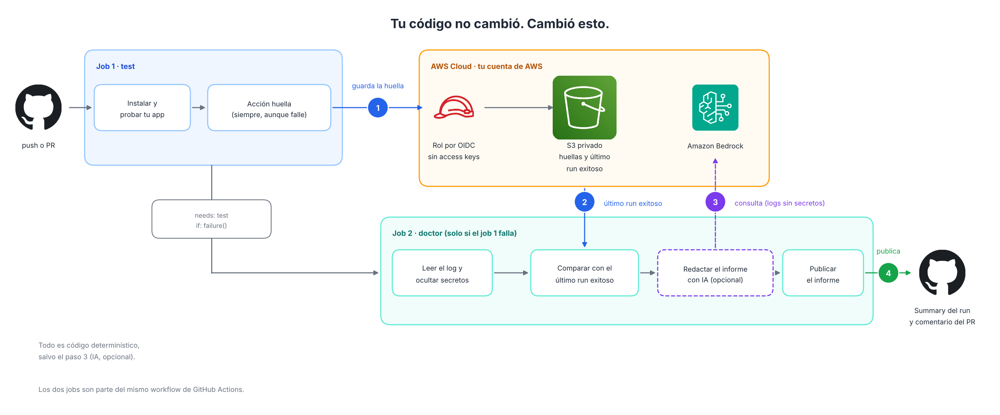

# Pipeline Doctor 🩺

**Cuando un pipeline que funcionaba falla, Pipeline Doctor compara el entorno de este run contra el último run verde y te dice qué cambió, aunque no hayas tocado tu código.**

Hoy existen asistentes que leen el log de un job fallido y proponen un arreglo. Pero muchos fallos de CI no vienen de tu código: salió una versión nueva de una dependencia, cambió la imagen del runner, se movió una etiqueta. Son los fallos del "ayer pasaba y hoy no", y el log por sí solo casi nunca los explica. Pipeline Doctor guarda una *huella* del entorno en cada run y, cuando algo falla, compara huellas.

> Estado: **v0**. Diagnostica y sugiere; no modifica tu código ni abre PRs. Funciona con GitHub Actions y AWS (S3 e IAM por OIDC, y Amazon Bedrock de forma opcional).

## Cómo funciona

<p align="center">
  <picture>
    <source media="(prefers-color-scheme: dark)" srcset="docs/arquitectura-oscuro.png">
    
  </picture>
</p>

**La comparación y los descartes los hace código determinístico, no un modelo.** Bedrock, si lo activas, solo redacta la explicación en lenguaje humano a partir de esa evidencia. Si no lo configuras, Pipeline Doctor igual te entrega el informe con la comparación.

La huella registra únicamente lo que está en una lista blanca: versiones de herramientas conocidas, paquetes de Python instalados (incluidos los transitivos), el commit de origen de las dependencias instaladas desde una URL, y el hash de archivos como `requirements.txt`, lockfiles, `Dockerfile` y los workflows.

## Ejemplo de informe

Así se ve el informe cuando una dependencia sin versión fijada saca una versión nueva y rompe el pipeline sin que cambie tu código. Aparece en el resumen del job y, si el run viene de un PR, como comentario:

> ### 🩺 Pipeline Doctor: consulta del run #14
>
> #### 🔍 Síntomas
>
> El job `test` falló en el paso *Correr tests*. Los tests fallan al intentar usar la función `parse` del módulo `fechautil`, que ahora no tiene ese atributo.
>
> #### 📜 Historial
>
> Último run verde: #13 (hace 2 min). **Tu código no cambió** entre #13 y #14 (mismo commit).
>
> #### 🧬 Qué cambió en el entorno
>
> | Qué | Último verde (#13) | Este run (#14) |
> |---|---|---|
> | Dependencia `fechautil` | `1.0.0` | `1.1.0` |
> | Origen (commit) `fechautil` | `e1acf51` | `a0d3865` |
>
> #### 🩺 Diagnóstico
>
> La dependencia `fechautil` pasó de 1.0.0 a 1.1.0 y la nueva versión ya no expone `parse`.
>
> **Descartado:**
>
> - Cambio de código: mismo commit
> - Cambio del runner: misma imagen en ambos runs
> - Cambio de herramientas: mismas versiones de Python, pip y demás
> - Cambio en archivos de dependencias o de workflows: mismo contenido
>
> #### 💊 Tratamiento
>
> Fija `fechautil==1.0.0` en tus requisitos mientras adaptas el código a la nueva versión.
>
> #### ✅ Validación
>
> En el próximo run, la huella debe mostrar `fechautil` en 1.0.0 y los tests deben pasar.
>
> ---
>
> **Confianza:** alta · *Pipeline Doctor propone, tú decides.*
>
> <sub>🤖 Texto redactado con IA (`amazon.nova-lite-v1:0` en Amazon Bedrock) a partir de la evidencia. La tabla de cambios sale de la comparación automática, no del modelo. La IA puede equivocarse: verifica antes de aplicar.</sub>

Dos detalles de diseño:

- La lista de **Descartado** la calcula el código a partir de la comparación, así que nunca puede incluir algo que sí cambió.
- Un informe sin IA tiene el mismo formato. Solo cambia la nota del final: *"Modo sin IA: el diagnóstico sale solo de la comparación automática."*

## Instalación

Necesitas una cuenta de AWS, [Terraform](https://developer.hashicorp.com/terraform/install) 1.6 o superior y el [AWS CLI](https://aws.amazon.com/cli/) configurado.

**1. Crea la infraestructura** (bucket privado, proveedor OIDC de GitHub y un rol con permisos mínimos):

```bash
cd infra/terraform
cp terraform.tfvars.example terraform.tfvars   # en PowerShell: copy
# edita github_repositories con tu dueño/repo
terraform init
terraform apply
```

**2. Guarda las variables en tu repositorio** (*Settings → Secrets and variables → Actions → pestaña Variables*). Son variables, no secretos: con OIDC no hay llaves que proteger.

| Variable | Valor |
|---|---|
| `PIPELINE_DOCTOR_ROLE_ARN` | salida `rol_arn` de Terraform |
| `PIPELINE_DOCTOR_BUCKET` | salida `bucket` de Terraform |
| `PIPELINE_DOCTOR_MODEL_ID` | opcional: ID de un modelo de Bedrock, por ejemplo `amazon.nova-lite-v1:0`. Si no la creas, funciona en modo sin IA |

**3. Agrega dos cosas a tu workflow.**

```yaml
jobs:
  test:
    runs-on: ubuntu-latest
    permissions:
      id-token: write        # entrar a AWS por OIDC
      contents: read
    steps:
      - uses: actions/checkout@v4
      # ... tus pasos de siempre (instalar, probar) ...

      - name: Pipeline Doctor, huella
        if: always()          # también queremos la huella de los runs que fallan
        continue-on-error: true
        uses: maikadevops-labs/pipeline-doctor/huella@v0
        with:
          aws-role-arn: ${{ vars.PIPELINE_DOCTOR_ROLE_ARN }}
          bucket: ${{ vars.PIPELINE_DOCTOR_BUCKET }}
          job-status: ${{ job.status }}

  doctor:
    needs: [test]
    if: failure()
    runs-on: ubuntu-latest
    permissions:
      id-token: write
      actions: read          # leer el log del job que falló
      contents: read         # comparar commits
      pull-requests: write   # comentar en el PR
    steps:
      - uses: maikadevops-labs/pipeline-doctor/diagnostico@v0
        with:
          aws-role-arn: ${{ vars.PIPELINE_DOCTOR_ROLE_ARN }}
          bucket: ${{ vars.PIPELINE_DOCTOR_BUCKET }}
          bedrock-model-id: ${{ vars.PIPELINE_DOCTOR_MODEL_ID }}   # vacío = modo sin IA
```

Para usarlo en otro repositorio, agrégalo a `github_repositories` en `terraform.tfvars` y vuelve a ejecutar `terraform apply`.

La primera vez no habrá nada con qué comparar: Pipeline Doctor guarda como referencia ("último verde") cada run exitoso de la rama principal. Haz que el job pase una vez en esa rama y, desde ahí, ya puede diagnosticar.

### Activar la IA con Amazon Bedrock (opcional)

1. Elige un modelo de Amazon disponible en tu región, por ejemplo `amazon.nova-lite-v1:0`, y comprueba que tu cuenta puede invocarlo:

   ```bash
   aws bedrock-runtime converse --model-id amazon.nova-lite-v1:0 \
     --messages '[{"role":"user","content":[{"text":"hola"}]}]' --region us-east-1
   ```

2. Crea la variable `PIPELINE_DOCTOR_MODEL_ID` con ese ID.

El rol creado por Terraform ya permite invocar los modelos `amazon.nova-*`. Para otro modelo, ajusta `bedrock_model_ids` en `terraform.tfvars`.

> Si tu cuenta de AWS es nueva, Bedrock puede responder `AccessDeniedException: Your account is currently being verified` hasta que AWS termine de verificarla (normalmente menos de 2 horas). Mientras tanto, Pipeline Doctor funciona en modo sin IA.

## Pruébalo con un paciente

Este repositorio incluye un laboratorio listo para reproducir dos fallos distintos: una dependencia que cambia sin avisar y un PR que rompe un test. Mira [`pacientes/`](pacientes/README.md).

## Seguridad

- **Sin access keys.** GitHub Actions entra a AWS con OIDC. El rol solo puede ser asumido por los repositorios que listes en Terraform.
- **Permisos mínimos.** El rol puede leer y escribir en `huellas/*` de un único bucket y, si activas la IA, invocar los modelos que indiques (por defecto, solo Amazon Nova).
- **Lista blanca.** La huella no vuelca variables de entorno ni nada fuera de lo que describe este README.
- **El log se limpia antes de salir.** Antes de enviarlo a Bedrock o publicarlo, se ocultan llaves de AWS, tokens de GitHub, GitLab y Slack, JWT, claves privadas, credenciales en URLs y valores de variables con nombres como `password`, `token` o `secret`. Es deliberadamente agresivo: prefiere ocultar de más. Si algo se oculta, el log del job indica qué tipo de dato y el nombre de la variable, nunca el valor.
- **El modelo solo escribe texto.** No ejecuta comandos ni abre PRs. Su respuesta se sanea antes de publicarse (sin enlaces, imágenes, menciones ni HTML), y el prompt le indica que trate el log como datos y no como instrucciones.
- **Transparencia.** Cuando un informe incluye texto escrito por un modelo, lo dice de forma explícita al final.
- **Bucket privado.** Acceso público bloqueado, cifrado en reposo, solo TLS, y las huellas se borran solas a los 90 días (configurable).
- **PRs desde forks.** GitHub no entrega token OIDC ni permisos de escritura a los forks, así que ahí Pipeline Doctor no corre. Es una limitación de GitHub y es lo correcto desde el punto de vista de seguridad.

## Costos

La infraestructura es un bucket de S3, un proveedor OIDC y un rol de IAM: sin servidores. La única parte con costo variable es Bedrock, y es opcional. Cada consulta envía unos pocos miles de tokens de log recortado y evidencia, así que el consumo por consulta es pequeño; revisa el precio vigente del modelo que elijas. Para borrar todo: `terraform destroy`.

## Limitaciones de la v0

- Corre en runners hospedados por GitHub (Linux o macOS), que traen `gh` y `aws` instalados. En runners propios, instala ambos.
- La huella cubre el entorno de **Python** (el `python3` y `pip` que tenga el job en el `PATH`) y las herramientas más comunes. Soporte para Node, Java y Docker está en el roadmap.
- Si un job usa `matrix`, todas las combinaciones comparten la misma clave de huella.
- Compara contra el último run verde de la rama principal, no contra el último run verde de tu rama.
- Si entre el último verde y el run fallido cambió código, el informe lo señala, pero no puede distinguir qué cambio causó el fallo: ese juicio sigue siendo tuyo.
- Solo diagnostica y sugiere.

## Roadmap

- Validar el arreglo en un sandbox (volver a correr el job que falló) antes de proponerlo.
- Abrir un PR con el diagnóstico, el parche y la evidencia, sin hacer merge nunca.
- Memoria de fallos y una suite de evals para medir la precisión del diagnóstico.
- Huellas para Node, Java y Docker (contribuciones bienvenidas).
- Soporte para GitLab CI.

## Desarrollo

```bash
pip install -r requirements-dev.txt
pytest -q
```

El código usa solo la librería estándar de Python (3.9 o superior) y se apoya en el AWS CLI y en `gh`, que ya traen los runners. Los tests incluyen un flujo completo con GitHub, S3 y Bedrock simulados.

## Licencia

MIT. Creado por [Maika Esteves](https://github.com/maikadevops-labs).
